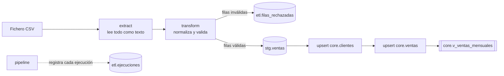
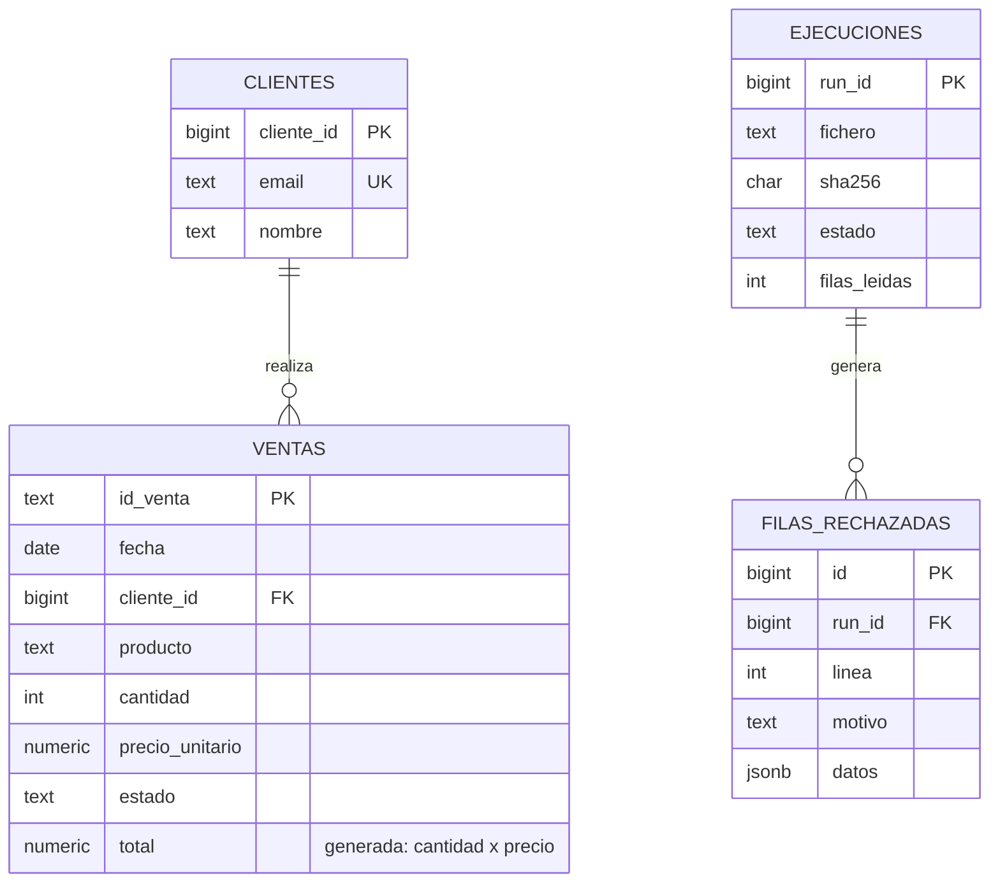

# ETL de ventas a PostgreSQL

Pipeline ETL en Python que lee ficheros CSV de ventas, los valida, aparta las filas erróneas
y los carga en PostgreSQL de forma **idempotente**: se puede ejecutar varias veces sobre el mismo
fichero sin duplicar datos, y si algo falla no deja la base de datos a medias.

> Proyecto de portfolio. Los datos de ejemplo son sintéticos y contienen errores a propósito
> (emails inválidos, cantidades negativas, fechas imposibles, ids repetidos y correcciones del día
> anterior) para demostrar cómo se gestionan.

## Qué demuestra

| Habilidad | Dónde verla |
|---|---|
| ETL con extracción, validación, transformación y carga | `etl/extract.py`, `etl/transform.py`, `etl/load.py` |
| Idempotencia y upsert (`INSERT … ON CONFLICT`) | `etl/load.py` (`SQL_UPSERT_VENTAS`) |
| Calidad de datos y filas rechazadas con su motivo | `etl/transform.py`, tabla `etl.filas_rechazadas` |
| Transacciones y recuperación ante errores | `etl/pipeline.py` |
| Reconciliación de recuentos | `Resultado.cuadra()` en `etl/transform.py` |
| Modelado relacional: claves, relaciones, restricciones | `sql/001_esquema.sql` |
| SQL: CTE, `DISTINCT ON`, `FILTER`, columnas generadas, vistas | `etl/load.py`, `sql/` |
| Python: pandas, SQLAlchemy, logging, CLI con `argparse` | `etl/` |
| Tests unitarios y de integración, lint y CI | `tests/`, `.github/workflows/ci.yml` |
| Entorno reproducible con Docker | `docker-compose.yml` |

## Arquitectura



Esquemas de la base de datos:

- `stg`: staging. Tabla `UNLOGGED` que se vacía y se vuelve a llenar en cada ejecución.
- `core`: modelo definitivo (`clientes`, `ventas`) y vistas de consulta.
- `etl`: control del proceso (`ejecuciones`) y filas rechazadas.

## Modelo de datos



## Cómo ejecutarlo

Requisitos: Python 3.10 o superior y Docker.

```bash
# 1. PostgreSQL (crea el esquema automáticamente la primera vez)
docker compose up -d --wait

# 2. Entorno de Python
python -m venv .venv && source .venv/bin/activate
pip install -r requirements-dev.txt
cp .env.example .env

# 3. Procesar los dos ficheros de ejemplo
python -m etl run data/sample/ventas_2026-10-01.csv
python -m etl run data/sample/ventas_2026-10-02.csv

# 4. Ver el resultado
python -m etl resumen
```

Resultado esperado:

```
 run estado   fichero                  leídas válidas rechaz. dupl. insert. actual.
   2 ok       ventas_2026-10-02.csv        36      32       4     0      25       6
   1 ok       ventas_2026-10-01.csv        45      40       4     1      40       0
```

- **Día 1**: 45 filas leídas. 40 válidas, 4 rechazadas y 1 duplicada (el `id_venta` V000005 aparece dos veces y gana la última).
- **Día 2**: 36 filas leídas. 25 ventas nuevas insertadas y 6 correcciones del día anterior actualizadas.

Más comandos:

```bash
python -m etl run data/sample/ventas_2026-10-01.csv   # mismo fichero: se omite
python -m etl run data/sample/ventas_2026-10-01.csv --forzar   # se reprocesa: 0 insertadas, 0 actualizadas
```

Consultas útiles (con `docker exec -it etl_postgres psql -U etl -d etl_demo`):

```sql
SELECT * FROM etl.v_resumen_ejecuciones;
SELECT linea, motivo, datos FROM etl.filas_rechazadas ORDER BY run_id, linea;
SELECT * FROM core.v_ventas_mensuales;
```

Sin Docker: crea las bases de datos `etl_demo` y `etl_test` en tu PostgreSQL, ajusta `DATABASE_URL`
en `.env` y ejecuta `python -m etl init-db` para crear el esquema.

## Decisiones de diseño

- **Idempotencia en dos niveles.** El upsert hace que reejecutar no duplique, y la huella
  SHA-256 del fichero permite omitir uno ya procesado. `--forzar` salta la segunda comprobación.
- **Una sola transacción por carga.** Staging, clientes, ventas, filas rechazadas y el cierre de la
  ejecución se confirman juntos. Si algo falla, todo se deshace. El registro del error se guarda
  en una transacción aparte para que no se pierda con el rollback.
- **Las filas inválidas no se descartan en silencio.** Se guardan con su línea, el motivo y la fila
  original en `etl.filas_rechazadas`.
- **Reconciliación.** Filas leídas = válidas + rechazadas + duplicadas. Si no cuadra, el proceso
  se detiene antes de cargar.
- **Todo se lee como texto.** `pandas` no infiere tipos ni convierte vacíos en `NaN`: la
  validación decide qué es válido.
- **Upsert que solo toca lo que cambia.** `WHERE (…) IS DISTINCT FROM (…)` evita escrituras
  innecesarias y hace que `actualizadas` cuente solo cambios reales.
- **Insertadas frente a actualizadas.** `RETURNING (xmax = 0)` distingue ambas. Es una técnica
  conocida de PostgreSQL basada en un detalle de implementación, no una garantía documentada.
- **Modelo relacional.** Clave sustituta para clientes y clave de negocio única (`email`),
  `ON DELETE RESTRICT` para no perder ventas, índices en las claves foráneas y una columna
  generada (`total`).
- **Staging `UNLOGGED`.** No escribe en el WAL: es más rápida y se puede perder sin problema,
  porque se rellena en cada ejecución.
- **Sin credenciales en el código.** Todo viene de variables de entorno (`.env`).

## Tests

```bash
make test        # 23 tests unitarios, sin base de datos
make test-int    # además 9 tests de integración (necesitan TEST_DATABASE_URL)
make lint
```

Los tests de integración **borran y recrean** los esquemas `stg`, `core` y `etl` de la base de
datos de `TEST_DATABASE_URL`. Usa siempre una base de datos aparte (`etl_test` en el compose).

Cubren, entre otros casos: la primera carga, no procesar dos veces el mismo fichero, que forzar
la recarga no cambie nada, correcciones del día siguiente, rechazadas guardadas con su motivo,
rollback completo ante un fallo a mitad de la carga y la clave foránea que impide borrar clientes
con ventas.

La integración continua (`.github/workflows/ci.yml`) ejecuta el lint y todos los tests contra un
PostgreSQL de servicio.

## Estructura

```
etl/            código del pipeline (extract, transform, load, pipeline, cli)
sql/            esquema y vistas
tests/          tests unitarios y de integración
scripts/        generador de datos de ejemplo (semilla fija)
data/sample/    dos ficheros CSV de ejemplo
docker/         base de datos de pruebas
docs/           cómo explicar el proyecto en una entrevista
```

## Límites y siguientes pasos

- Carga por fichero completo. Un siguiente paso es una **carga incremental con marca de agua**
  contra una fuente viva.
- No gestiona **borrados** del origen: solo altas y modificaciones.
- Se ejecuta a mano. Siguiente paso: programarlo con cron, GitHub Actions o **Airflow**.
- Conectar **Power BI** a `core.v_ventas_mensuales` para tener un cuadro de mando.
- Mover las transformaciones SQL a **dbt**.

## Qué he aprendido

> Escribe aquí, con tus palabras, 3 o 4 líneas: qué te costó más, qué decisión cambiarías y
> qué harías con más tiempo. Es lo primero que un entrevistador lee.
